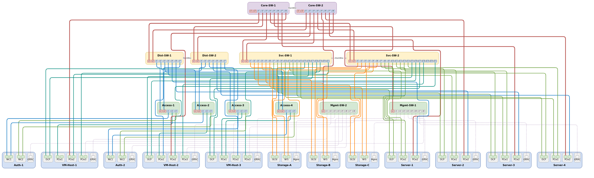

# drawio-wiring

Python スクリプトで draw.io 物理配線図を自動生成するライブラリ。外部依存ゼロ（Python 3 標準ライブラリのみ）。



## 特徴

- **自動レイアウト** — Sugiyama 法ベースのレイヤー配置でデバイスを自動整列
- **3種のルーティングエンジン** — NaiveRouter / LeftEdgeRouter / ObstacleRouter を用途に応じて選択
- **レイヤー機能** — ケーブルを draw.io レイヤーに自動分類し、表示/非表示を切替可能
- **draw.io 互換** — 生成された `.drawio` ファイルは [app.diagrams.net](https://app.diagrams.net) でそのまま閲覧・編集可能
- **インストール不要** — `pip install` や仮想環境は不要。`python3` のみで動作

## クイックスタート

```bash
git clone https://github.com/kloir-z/drawio-wiring.git
cd drawio-wiring

# サンプル実行
python3 examples/datacenter.py
# → examples/datacenter.drawio が生成される
```

生成された `.drawio` ファイルを [app.diagrams.net](https://app.diagrams.net) で開いて確認できます。

## 基本的な使い方

```python
import sys
sys.path.insert(0, 'lib')

from wiring_diagram import Topology, ObstacleRouter
from wiring_diagram import BG_BLUE, BG_GREEN, PORT_BLUE, PORT_RED

T = Topology()

# デバイス追加
T.add_device("sw1", label="Switch-1", style=BG_GREEN, layer=0,
             ports=[("p1", PORT_RED), ("p2", PORT_RED)])
T.add_device("srv1", label="Server-1", style=BG_BLUE, layer=1,
             ports=[("eth1", PORT_BLUE), ("eth2", PORT_BLUE)])

# ケーブル接続
T.add_cable("sw1", "p1", "srv1", "eth1",
            style="strokeColor=#0070C0;strokeWidth=2;")

# 図を生成・保存
D = T.to_diagram(router=ObstacleRouter(), cable_layers=True)
D.save("output.drawio")
```

## API リファレンス

### Topology（高レベル API）

| メソッド | 説明 |
|----------|------|
| `add_device(id, label, style, layer, ports=[], cards=[])` | デバイス追加（flat またはカード構造） |
| `add_cable(src_dev, src_port, dst_dev, dst_port, style, label="", layer=None)` | ケーブル追加 |
| `add_simple_link(src_dev, dst_dev, label, style, layer=None)` | 直結リンク追加（StackWise 等） |
| `to_diagram(router=None, cable_layers=False, ...)` | 自動レイアウトして Diagram を返す |

### Diagram（低レベル API）

| メソッド | 説明 |
|----------|------|
| `device(id, label, x, y, ports, style)` | スイッチ等（ポート横1列） |
| `device_carded(id, label, x, y, cards, style)` | サーバ（NIC カード構造） |
| `add_edge(..., zone=None, layer=None)` | ケーブルをキュー登録 |
| `simple_edge(src_id, tgt_id, label, style, layer=None)` | 直結エッジ |
| `add_layer(name)` | draw.io レイヤー追加 |
| `save(path)` | XML 書き出し |

### ルーター

| クラス | 特徴 |
|--------|------|
| `NaiveRouter` | 1エッジ1レーン。シンプル |
| `LeftEdgeRouter` | レーン圧縮 + barycenter 交差最小化 |
| `ObstacleRouter` | LeftEdgeRouter + デバイス迂回 + 垂直重なり回避 |

## サンプル実行

```bash
# サンプル図の生成
python3 examples/datacenter.py

# テスト実行
python3 -m unittest discover -s tests
```

## ライセンス

MIT
